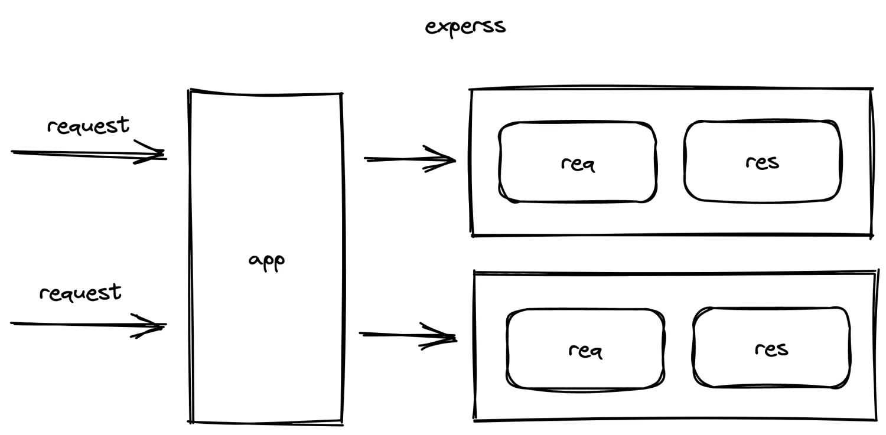
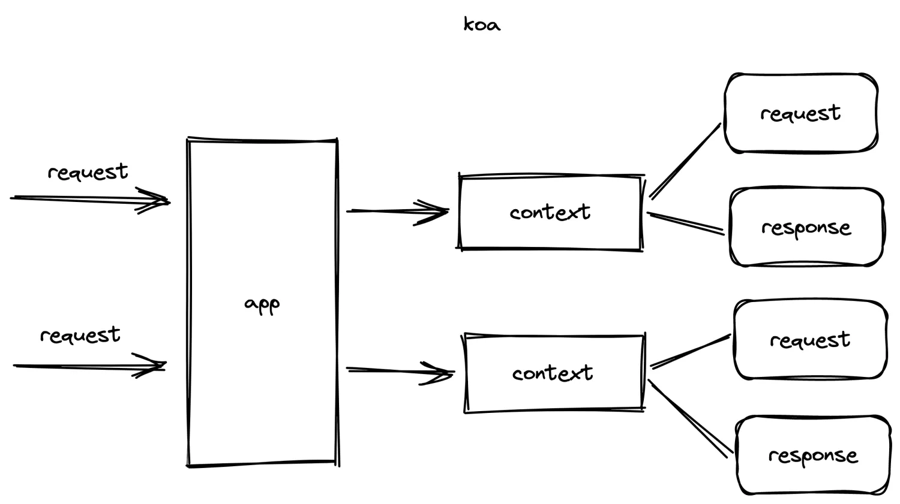

[[toc]]

## Koa概述

>官网：https://koajs.com/
>
>民间中文网：https://koa.bootcss.com/

Koa是一个新的web框架，有express幕后的原班人马打造，为搭建web服务器提供更轻量、更优雅的方案。

## 对比Express

### 更轻量

在express的基础上进一步简化了框架，这些简化表现在下面两个方面：

1. koa没有内置的中间件
2. koa不提供路由匹配

### 更合理的对象结构

express主要操作对象由app、req、res，他们的逻辑关系如下：



而在koa中，他的主要操作对象有app、context、request、response，他们的逻辑关系如下：



### 更友好的中间件支持

koa最大的优势，就是他支持异步中间件，从而提供了基于合理的中间件模型：
```js
// express 中间件示例
function delay(duration) {
  return new Promise(resolve => {
    setTimeout(() => {
            resolve()
    }, duration)
  })
}

// 中间件1
app.use(function(req, res, next) {
  console.log(1)
  next()
  console.log(4)
})

// 中间件2
app.use(async function(req, res, next) {
  console.log(2)
  await delay(1000)
  console.log(3)
})

// 得到的结果：1 2 4 3

```

这会导致一系列的问题。

而koa是真正支持异步的中间件模型：

```js
// koa 中间件示例
function delay(duration) {
  return new Promise(resolve => {
    setTimeout(() => {
            resolve()
    }, duration)
  })
}

// 中间件1
app.use(function(ctx, next) {
  console.log(1)
  await next()
  console.log(4)
})

// 中间件2
app.use(async function(ctx, next) {
  console.log(2)
  await delay(1000)
  console.log(3)
})

// 得到的结果：1 2 3 4
```

可以看到，对于每个中间件，在完成一些事情之后，可以非常优雅的将控制权移交下一个中间件，并能够等待他完成，当后续的中间件完成处理之后，控制权又回到了自己，这种中间件模型称之为洋葱模型。

## Koa示例

```js
// 创建koa应用
import Koa from 'koa'
const app = new Koa()

app.listen(3000)

// 注册中间件
app.use(middleware1)
app.use(middleware1)
app.use(middleware1)

// 中间件的函数格式如下：
function (ctx, next) {
  // ctx 为上下文对象
  // next 调用下一个中间件
}
```
## context

context 包含四个重要对象：

 - req：http模块内置对象
 - res：http模块内置对象
 - request：koa封装的请求对象，用于获取请求传递的信息
 - response：koa封装的响应对象，用户设置响应信息

koa不建议使用原生对象，建议使用框架封装的对象

## cookie

koa原生支持cookie，不需要安装其他中间件。

> 使用 keygrip 完成加密，该库使用多个秘钥，轮流用他们对目标进行加密，在解密时，选择合适的秘钥进行解密，这种叫做旋转加密，更加难以破解